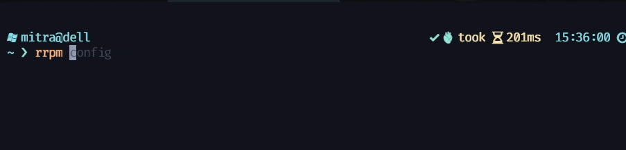

# Viewing and Regenerating or Customizing the Config

### Viewing the Current Config File

The current config file can be viewed by running the command `rrpm config`.

```bash
$ python -m rrpm config
{
    'root': {'dir': '%USERPROFILE%\\Projects', 'ext_dir': '%LOCALAPPDATA%\\rrpm\\extensions'},
    'cli': {'display_output': False, 'extensions': ['myext']}
}
```

### Regenerating the Config File

```bash
$ python -m rrpm config --regenerate
Config file regenerated successfully!
```

### Customizing the Config File

:::note
New in version 1.4.0
:::

The `--generate` flag in the `rrpm config` command, provides an interactive prompt to customize your config.

